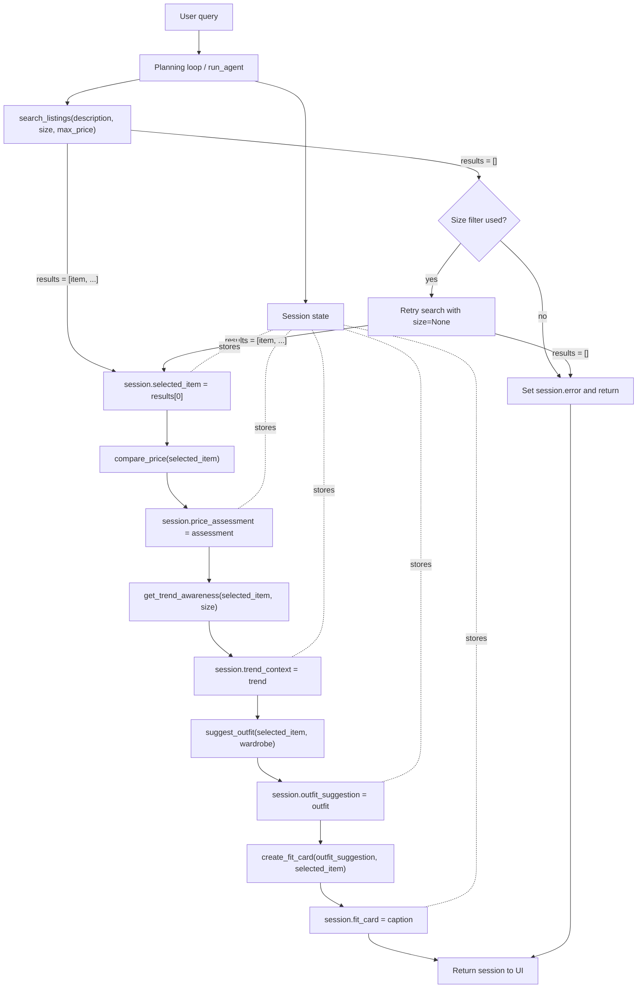

# FitFindr Planning

## A Complete Interaction

FitFindr helps a user move from a thrift search request to a styled outfit and a caption-like fit card. The agent first searches mock listings using the requested item, size, and max price; if nothing usable is found, it returns a helpful error and stops. When a listing is found, the selected listing is stored in session state, passed into price comparison, trend awareness, outfit generation, and then passed with the outfit suggestion into fit-card generation.

Example query: "I'm looking for a vintage graphic tee under $30, size M. I mostly wear baggy jeans and chunky sneakers."

1. The planning loop parses `description="I'm looking for a vintage graphic tee"`, `size="M"`, and `max_price=30.0`.
2. It calls `search_listings(description, size, max_price)`.
3. If results are empty, it retries once without the size filter. If still empty, it sets `session["error"]` and returns.
4. If results exist, it sets `session["selected_item"] = results[0]`.
5. It calls `compare_price(session["selected_item"])` and stores the returned dictionary in `session["price_assessment"]`.
6. It calls `get_trend_awareness(session["selected_item"], size)` and stores the returned dictionary in `session["trend_context"]`.
7. It calls `suggest_outfit(session["selected_item"], wardrobe)`, appends the trend styling tip, and stores the returned string in `session["outfit_suggestion"]`.
8. It calls `create_fit_card(session["outfit_suggestion"], session["selected_item"])` and stores the caption in `session["fit_card"]`.
9. The user sees the selected listing, price check, trend-aware outfit suggestion, fit card, and planning trace.

## Tool 1: search_listings

- Signature: `search_listings(description: str, size: str | None = None, max_price: float | None = None) -> list[dict]`
- Purpose: Search the local mock listings dataset for items matching a natural-language description, optional exact size, and optional maximum price.
- Inputs:
  - `description`: user text describing the desired item, such as `"vintage graphic tee"`.
  - `size`: exact size filter, such as `"M"`, `"L"`, `"8"`, or `None`.
  - `max_price`: maximum listing price in dollars, or `None`.
- Output: A relevance-sorted list of listing dictionaries. Each listing includes `id`, `title`, `description`, `category`, `style_tags`, `size`, `condition`, `price`, `colors`, `brand`, and `platform`.
- Failure mode: If loading fails or no listing matches, return `[]`. The agent then either retries without size or stops with a message telling the user to broaden the search, raise the max price, or leave size blank.

## Tool 2: suggest_outfit

- Signature: `suggest_outfit(new_item: dict, wardrobe: dict) -> str`
- Purpose: Suggest a complete outfit using the selected listing and the user's existing wardrobe.
- Inputs:
  - `new_item`: one listing dictionary selected by the agent.
  - `wardrobe`: dictionary containing an `items` list. Each item has `id`, `name`, `category`, `colors`, `style_tags`, and optional `notes`.
- Output: A user-facing outfit suggestion string with specific pieces and styling advice.
- Failure mode: If `new_item` is missing, return `"I need a selected listing before I can build an outfit."` If the wardrobe is empty, return general styling advice using common closet basics instead of crashing.

## Tool 3: create_fit_card

- Signature: `create_fit_card(outfit: str, new_item: dict) -> str`
- Purpose: Convert a complete outfit suggestion into a short, shareable caption.
- Inputs:
  - `outfit`: string returned by `suggest_outfit`.
  - `new_item`: selected listing dictionary.
- Output: A caption-style fit card string under roughly 35 words when the LLM path is available, or a local template caption when offline.
- Failure mode: If `outfit` is empty, return `"I need an outfit suggestion before I can write a fit card."` If `new_item` is missing, return `"I need the thrifted item details before I can write a fit card."`

## Stretch Tool: compare_price

- Signature: `compare_price(new_item: dict) -> dict`
- Purpose: Estimate whether the selected listing price is a good deal, fair, or pricey compared with similar listings in the mock dataset.
- Inputs:
  - `new_item`: one listing dictionary selected by the agent.
- Output: A dictionary with `assessment`, `item_price`, `average_comparable_price`, `comparable_count`, `comparable_titles`, and `reasoning`.
- Failure mode: If `new_item` is missing, return `assessment="unknown"` with a message that a selected listing is required. If no comparables exist, return `assessment="unknown"` with a message explaining that there is not enough dataset evidence.

## Stretch Tool: get_trend_awareness

- Signature: `get_trend_awareness(new_item: dict, size: str | None = None) -> dict`
- Purpose: Return trend context for the selected item using a local mock snapshot of recent public fashion-platform style tags.
- Inputs:
  - `new_item`: one listing dictionary selected by the agent.
  - `size`: optional requested size used to add size-aware reasoning.
- Output: A dictionary with `source`, `trend_tags`, `styling_tip`, and `reasoning`.
- Failure mode: If `new_item` is missing, return an empty `trend_tags` list and a reason explaining that a selected listing is required.

## Planning Loop

The loop uses `next_step` and session state to decide which tool to call. It starts at `"search"`, then moves only when the current state has the required data for the next tool.

1. Initialize session keys: `query`, `search_params`, `listings`, `selected_item`, `selected_item_summary`, `price_assessment`, `trend_context`, `outfit_suggestion`, `fit_card`, `error`, and `trace`.
2. When `next_step == "search"`, call `search_listings()` with parsed parameters.
3. If search returns `[]` and a size filter was used, retry once with `size=None` and add the fallback to `trace`.
4. If search still returns `[]`, set `session["error"]`, append a stop message to `trace`, and end the loop.
5. If search returns listings, set `session["listings"]`, set `session["selected_item"] = listings[0]`, and set `next_step = "price_check"`.
6. When `next_step == "price_check"`, call `compare_price(selected_item)` and store the returned dictionary in `session["price_assessment"]`.
7. When `next_step == "trend_check"`, call `get_trend_awareness(selected_item, size)` and store the returned dictionary in `session["trend_context"]`.
8. When `next_step == "outfit"`, call `suggest_outfit(selected_item, wardrobe)`. If there is no selected item, set an error and stop. Otherwise append the trend styling tip, store the string in `session["outfit_suggestion"]`, and set `next_step = "fit_card"`.
9. When `next_step == "fit_card"`, call `create_fit_card(outfit_suggestion, selected_item)`, store the result, and end the loop.

This is not a fixed unconditional sequence because the loop stops after failed search and does not call outfit or fit-card tools without a selected item.

## State Management

State is stored in a single `session` dictionary returned by `run_agent()`. The search result flows into `session["selected_item"]`, that exact dictionary is passed to `compare_price()`, `get_trend_awareness()`, and `suggest_outfit()`, the returned outfit string plus trend note is stored in `session["outfit_suggestion"]`, and both values are passed to `create_fit_card()`. The `trace` list records each tool call and branch so the demo can show state moving through the workflow. The UI also keeps `profile_memory_state`, so a second interaction can reuse the previous size, max price, "I mostly wear" value, and closet profile without re-entry. The profile memory intentionally does not store the searched item; it stores the user's shopping preferences.

## Architecture

## Error Handling

| Tool | Triggered failure | Tool response | Agent response |
| --- | --- | --- | --- |
| `search_listings` | No listings match item, size, and price | Returns `[]` | Retry without size if size was used. If still empty, set `session["error"]` explaining how to broaden the query. |
| `search_listings` | Dataset cannot be loaded | Returns `[]` | Same as no-results path, so the agent stays user-facing and does not crash. |
| `suggest_outfit` | Missing selected item | Returns a clear "I need a selected listing" message | Agent normally prevents this by checking `selected_item` before calling. |
| `suggest_outfit` | Empty wardrobe | Returns styling advice using common closet basics | Agent continues to fit-card generation because the output is still useful. |
| `create_fit_card` | Empty outfit string | Returns a clear "I need an outfit suggestion" message | Agent stores the message instead of raising an exception. |
| `compare_price` | Missing selected item or no comparable listings | Returns `assessment="unknown"` plus specific reasoning | Agent can still continue to outfit generation because price comparison is helpful but not required. |
| `get_trend_awareness` | Missing selected item | Returns empty trend tags plus specific reasoning | Agent normally prevents this by checking `selected_item`; when available, trend tips visibly influence the outfit suggestion. |

## AI Tool Plan

- Planning document: I will give the AI tool the assignment requirements and ask it to turn them into concrete tool specs, a state list, and an architecture diagram. I will verify that every tool signature in the spec matches the code.
- Tool implementation: I will give the AI tool one tool section at a time and ask for implementations in `tools.py` using `load_listings()` for search and Groq only as an optional LLM path for text generation. I will verify filters, empty-result behavior, empty-wardrobe behavior, price-comparison reasoning, and trend-tag output with tests.
- Planning loop: I will give the AI tool the Planning Loop and Architecture sections and ask it to implement `run_agent()` with state branches. I will verify that no-results search stops before `suggest_outfit()` and that successful search passes the same selected item dict forward.
- UI and memory: I will give the AI tool the app requirements and ask for a clearer filter-based Gradio UI with profile memory and history. I will verify that a second interaction can use the remembered size, price, style, and closet profile and that the history table records the result.
- Documentation: I will give the AI tool the finished code and ask for a concise README. I will verify that the README describes actual behavior, not aspirational behavior.

## Complete Interaction Walkthrough

Input: `"I'm looking for a vintage graphic tee under $30, size M. I mostly wear baggy jeans and chunky sneakers."`

1. `run_agent()` parses `description="I'm looking for a vintage graphic tee"`, `size="M"`, `max_price=30.0`.
2. The planner calls `search_listings(description, size="M", max_price=30.0)`.
3. Search finds the matching `Faded Band Tee` listing for `$22` on Depop and returns it in a list.
4. The planner stores that listing in `session["selected_item"]`.
5. The planner calls `compare_price(selected_item)` and stores a deal/fair/pricey assessment in `session["price_assessment"]`.
6. The planner calls `get_trend_awareness(selected_item, size)` and stores trend tags and a styling tip.
7. The planner calls `suggest_outfit(selected_item, wardrobe)`.
8. The outfit tool suggests pairing the tee with wardrobe pieces such as baggy light-wash jeans and chunky black sneakers, then the planner appends the trend-aware note.
9. The planner stores the suggestion in `session["outfit_suggestion"]`.
10. The planner calls `create_fit_card(outfit_suggestion, selected_item)`.
11. The user sees the selected listing, price assessment, trend cue, outfit suggestion, a short caption, and a trace showing the tool calls.

Failure walkthrough: `"designer ballgown under $5, size XXS"` calls search, receives `[]`, retries without size, receives `[]`, sets `session["error"]`, and returns without calling outfit or fit-card tools.
